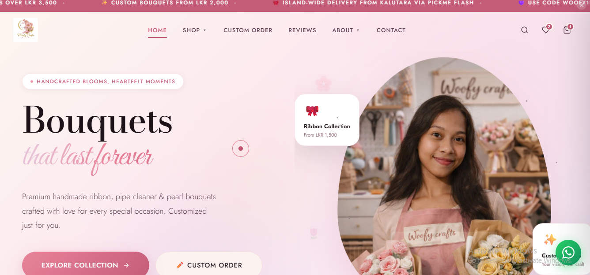
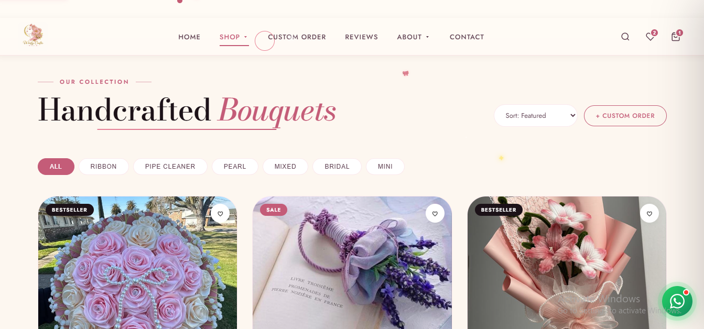
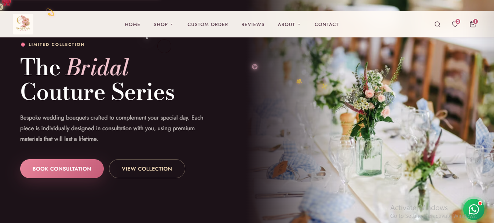

# 🌸 Woofy Crafts

> **Handcrafted Blooms, Heartfelt Moments**

A fully responsive, single-page e-commerce website for **Woofy Crafts** — a boutique handcrafted bouquet brand. Built with pure HTML, CSS, and vanilla JavaScript. No frameworks, no build tools, no dependencies.

[](#)
[](#license)
[](#)

---

## 📸 Preview

| Hero Section | Products Grid | Custom Order Form |
|:---:|:---:|:---:|
|  |  |  |

---

## ✨ Features

- 🛒 **Shopping Cart** — Add, remove, update quantities with real-time total
- 💖 **Wishlist** — Save favourites across the session
- 🔍 **Search** — Instant keyword search across the product catalogue
- 🎨 **Custom Order Form** — Full bouquet customisation (type, budget, occasion, colours, message)
- 📱 **WhatsApp Chat Panel** — In-page WhatsApp-style widget with quick replies
- 🌸 **Petal & Sparkle Animations** — Floating petal effects, cursor animations, click bursts
- 📦 **Product Filtering & Sorting** — Filter by category, sort by price/name/featured
- ⭐ **Customer Reviews** — Star-rated testimonial grid
- 🖼️ **Instagram Gallery** — Showcase section linked to `@woofycrafts_hasii`
- 📜 **Policy Modals** — Shipping, returns, and privacy policy in-page overlays
- 👩‍🎨 **Founder Spotlight** — About Us section with bio and stats
- 📣 **Announcement Bar** — Scrolling marquee for promotions
- 🌙 **Dark Mode Support** — Automatic CSS variable theming
- 📲 **Fully Responsive** — Mobile-first design with hamburger navigation

---

## 🗂️ Project Structure

```
woofy-crafts/
├── index.html          # Entire site — HTML, CSS & JS in one file
├── README.md           # Project documentation (this file)
├── .gitignore          # Git ignore rules
└── docs/
    ├── FEATURES.md     # Detailed feature breakdown
    ├── CUSTOMIZATION.md # How to update content & styling
    └── DEPLOYMENT.md   # Hosting & deployment guide
```

---

## 🚀 Quick Start

No build step needed. Just open the file in a browser:

```bash
# Clone the repository
git clone https://github.com/YOUR_USERNAME/woofy-crafts.git

# Navigate into the folder
cd woofy-crafts

# Open in browser (macOS)
open index.html

# Open in browser (Windows)
start index.html

# Or use VS Code Live Server
code .
```

---

## 🛠️ Customisation

All content, colours, and products are configured directly inside `index.html`.

| What to change | Where to find it |
|---|---|
| Brand colours | `:root` CSS variables at the top of `<style>` |
| Product catalogue | `const PRODUCTS = [...]` in the `<script>` section |
| Customer reviews | `const REVIEWS = [...]` in the `<script>` section |
| WhatsApp number | `wa.me/YOUR_NUMBER` in the WhatsApp panel HTML |
| Social links | Footer `<a>` tags |
| Logo image | `` |
| Announcement bar | `#announce-bar` section |

> 📖 See [`docs/CUSTOMIZATION.md`](docs/CUSTOMIZATION.md) for a full step-by-step guide.

---

## 🌐 Deployment

This site can be deployed for **free** on any static hosting platform:

| Platform | Steps |
|---|---|
| **GitHub Pages** | Push to `main` → Settings → Pages → Deploy from branch |
| **Netlify** | Drag & drop the folder on [netlify.com/drop](https://app.netlify.com/drop) |
| **Vercel** | `vercel --prod` from the project folder |
| **Cloudflare Pages** | Connect repo → Framework: None → Build: skip |

> 📖 See [`docs/DEPLOYMENT.md`](docs/DEPLOYMENT.md) for detailed instructions.

---

## 📋 Sections Overview

| Section | ID | Description |
|---|---|---|
| Announcement Bar | `#announce-bar` | Scrolling promotional banner |
| Navigation | `#navbar` | Sticky nav with cart, wishlist, search |
| Hero | `#hero` | Full-screen landing with CTA |
| Categories | `#categories` | Browse by bouquet type |
| Products | `#products` | Filterable & sortable product grid |
| Featured | `#featured` | Bridal Couture spotlight banner |
| Why Us | `#why` | Brand values & selling points |
| Custom Order | `#custom` | Bespoke bouquet request form |
| Reviews | `#reviews` | Customer testimonials |
| Gallery | `#gallery` | Instagram photo grid |
| Policies | `#policies` | Shipping, returns, privacy |
| About | `#about` | Brand story & founder spotlight |
| Contact | `#contact` | Contact form & details |

---

## 🎨 Colour Palette

| Variable | Value | Usage |
|---|---|---|
| `--c-wine` | `#8B1A4A` | Primary brand colour |
| `--c-blush` | `#F5A0B8` | Accent / highlights |
| `--c-cream` | `#FDF7F0` | Background |
| `--c-gold` | `#C9960C` | Stars & premium accents |
| `--c-ink` | `#1A0A12` | Body text |

---

## 🤝 Contributing

Contributions are welcome! Here's how:

1. **Fork** this repository
2. **Create** a feature branch: `git checkout -b feature/your-feature`
3. **Commit** your changes: `git commit -m "Add: your feature"`
4. **Push** to the branch: `git push origin feature/your-feature`
5. **Open** a Pull Request

---

## 📄 License

This project is licensed under the **MIT License** — see the [LICENSE](LICENSE) file for details.

---

## 👩‍🌸 About the Brand

**Woofy Crafts** is a Sri Lanka-based handcrafted bouquet brand specialising in floral arrangements for weddings, anniversaries, graduations, and all of life's special moments. Every piece is made by hand with love.

📸 Instagram: [@woofycrafts_hasii](https://instagram.com/woofycrafts_hasii)

---

<p align="center">Made with 💖 and 🌸 by Woofy Crafts</p>
